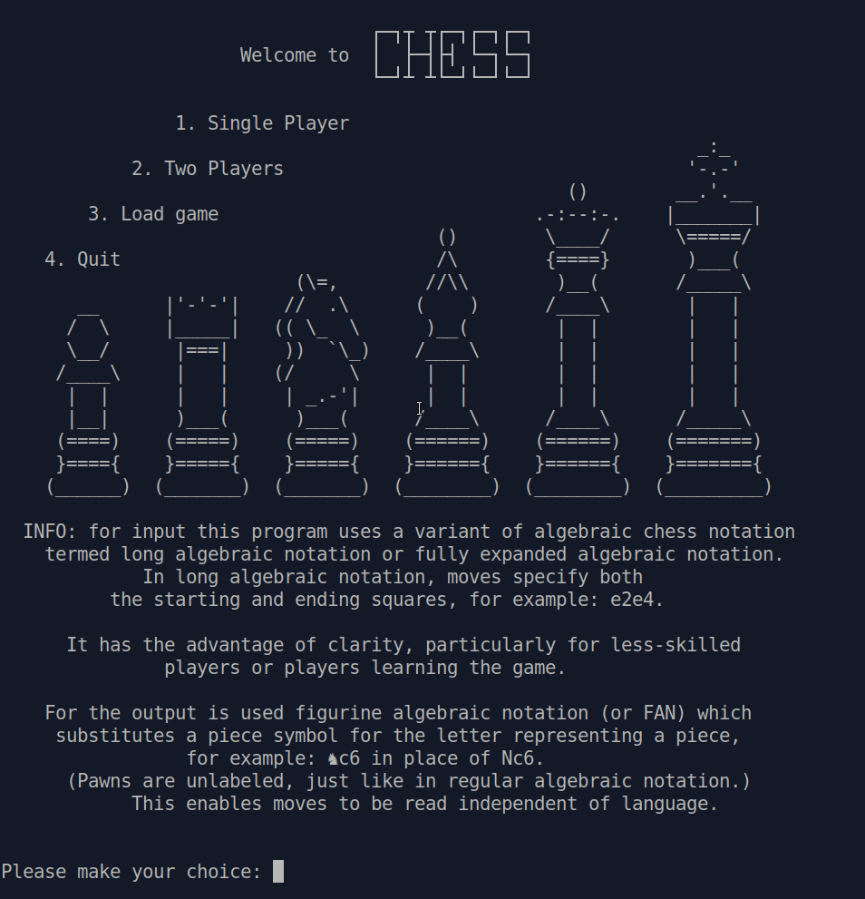

# Project: Chess

### User interface

- CLI — Command Line Applications/Interface

### What's this

This is the final project from The Odin Project's Ruby Learning Track. The task is to make a Ruby command line Chess game where two players can play against each other. 

## Reflection

There are lots of implementations of Chess' games available on the internet, most of them richer in features than this one. But that's not the point. This one was really interesting for me in terms of breaking the problem down into components and solving one by one.

I made my application without having to get any ideas from outside sources (beyond what the project suggested and programming that I'd already done), which was really rewarding when I got it working.

I will try to explain some of the concepts I used when developing the game, if you have any suggestions on how I could improve the code feel free to create a Pull request or reach me out directly in Discord.

Here is a short rundown of the structure. The library consists of 5 main parts:

1. `main.rb`: Entry-point of the application. Prompts the user for an action (new single/two players game, load/save game, restart game, quit) and, depending on the action to be performed, calls the functions from the `game.rb`.

2. `game.rb`: Controller of the application/game flow. Sets up the requested game (`Setup` module), receives the input in [Long Algebraic Notation](https://en.wikipedia.org/wiki/Algebraic_notation_(chess)#Long_algebraic_notation) format, validates it, converts it to the board coordinates (`LanConverter` module), and then passes the converted input to the model (`board.rb`). Loops between players until the game is finished. It contains an additional save&load functionality (`SaveLoad` module).

3. `board.rb`: The central component, the heart and backbone of the application. It directly manages the data, logic and rules of the game. It receives converted user input, legalize the move in base of rules and chess position, updates its view and saves all the game stats necessary to continue playing.

4. `pieces`: Move generators. Each piece is responsible for its own moves' generation, they don't know much besides that. All of them obey their normal rules of movement, the legality check is left to the board.

5. `player`: human player is implemented as a `Struct` under the `Game` class, `Computer` player is a very basic AI who does a random legal move.

I tried to design the application in a way that, if there will be any future improvement, minor changes should be made to the existing classes. For example, if we want to change the user input from LAN to SAN, needed changes would be basically to replace the `LanConverter` module with a new `SanConverter`. Or, let's say we want to improve our AI brains and teach it how to find the best move, we have `Computer` class as a good starting point.

From this point of view, I was really tempted to introduce a `View` class responsible for the representation of `Board` information. Ex., if we want to improve our CLI with the inversion of colors based on the background color of the terminal, or flip the board on the next player switch.

Another design centric decision I made is to extract parts of the `Board` class into smaller, tightly focused and well-defined modules to make easier the research and fix of eventual bugs. I still have some doubts that this could be code smell.

In general, I tried to keep all the classes highly coesive, well-encapsulated and dry. I want to think my attempt was successful. 

And the last, but not the least point. As far as this project has a lot of different components to it, it was extremely important to write bug free code. The best strategy was surely to TDD it, which I mostly did, however I tried to create an extended testing suite so that every single piece of code gets tested, no matter how simple it looks.

## Eventual Improvements List

If there is one thing to say about building chess — it's the same addiction as playing it, and it’s never finished.

- [ ] `invert_term_color` method. How chess board colors black and white are displayed might depend on the background color of the terminal. Change, if black and white are mixed up.

- [ ] `Engine` class. Contains the algorithm for searching every possible move and deciding which move is the best reply in the particular position. It will also contain an evaluation method that takes a position and decides who is ahead.

- [ ] `flip_board` method. The visualization of the playboard should change based on the side to move: Whites to move - white pieces on the bottom, Blacks to move - blacks pieces on the bottom.

- [ ] `FEN input/output` module. 

- [ ] `Instructions` menu. Contains the chess rules and input instructions.